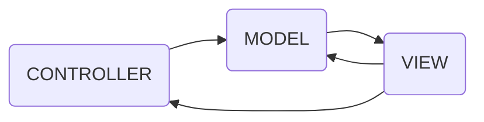
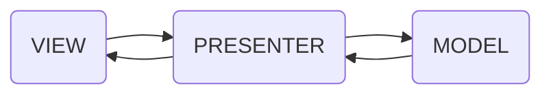
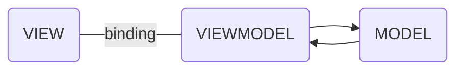

* content
{:toc}

Android本身被写成MVC，其中Activity或多或少地负责所有事情。对于可能足够的简单应用，但随着复杂性的增加，问题的数量和水平也会提高。
现在有许多不同的架构方法，如MVP，FLUX，MVI，MVVM等，它们在解决上述问题方面证明是富有成效的。只要代码可维护，我们就可以使用任何方法，我们能够快速适应变化，一切运行良好，简而言之就是开发人员的快乐生活。


###### MVC
传统的Android App其实都是基于MVC的，Activity，Fragment相当于C,布局相当于V,数据逻辑相当于M
随着业务的增长Controller里的代码会越来越臃肿，因为它不只要负责业务逻辑，还要控制View的展示。也就是说Activity、Fragment杂糅了Controller和View，耦合变大。并不能算作真正意义上的MVC。




###### MVP
MVP架构其实可以说与MVC的架构还是有很大的差别的，数据逻辑相当于M，Activity（负责View的绘制以及与用户交互）相当于V ，View于Model间的交互则为P其实最明显的区别就是，MVC中是允许Model和View进行交互的，而MVP中很明显，Model与View之间的交互由Presenter完成。还有一点就是Presenter与View之间的交互是通过接口的




* 缺点
1. 紧耦合
对于每个活动/片段（视图），我们需要一个Presenter。这是一个硬约束规则。Presenter保存对Activity和Activity的引用保留对presenter的引用。1：1的关系，这就是最大问题所在。
随着视图复杂性的增加，这种关系的维护和处理也会增加。
这最终会导致我们之前遇到的同样问题，因为设计的快速变化，我们实际上需要修改整个关系。
从我们的最终目标“以分布式方式构建事物”中挑选一个声明，为了实现它并避免这种紧密关系，ViewModels被引入。
ViewModels是与逻辑/模型层交互的简单类，只是暴露状态/数据，实际上不知道该数据将由谁或如何使用。只有View（Activity）保存对ViewModel的引用，反之亦然，这解决了我们的紧耦合问题。单个视图可以保存对多个ViewModel的引用。
即使对于复杂的视图，我们实际上可以在同一层次结构中具有不同的ViewModel
2. 可测性
由于Presenters很难绑定视图，因此编写单元测试变得有点困难，因为View具有依赖性。
ViewModels甚至更加单元测试友好，因为它们只是暴露状态，因此可以独立测试而无需测试数据的消耗方式，简而言之，View不依赖于View。
这是两个主要的选择，使选择明确。可能有更多或可能没有。以下评论正在等待!! 😄

###### MVVM
MVVM是Model-View-ViewModel的简写. 它是有三个部分组成：Model、View、ViewModel。Model：数据模型层。包含业务逻辑和校验逻辑,View：屏幕上显示的UI界面（layout、views）,ViewModel：View和Model之间的链接桥梁，处理视图逻辑。
当View有用户输入后，ViewModel通知Model更新数据，同理Model数据更新后，ViewModel通知View更新。





### MVVM其实与MVP架构看起来很相似


### 代码示例

* MVVM

```java
/**
 * @author whs
 * @date 2019/3/29
 * 清障救援
 */
public class RescueActivity extends WtActivity {

    private ActivityRescueBinding mBinding;
    private RescueViewModel mViewModel;

    @Override
    protected void onCreate(@Nullable Bundle savedInstanceState) {
        super.onCreate(savedInstanceState);
        mBinding = DataBindingUtil.setContentView(this, R.layout.activity_rescue);
        mBinding.toolbar.setNavigationOnClickListener(view -> onBackPressed());
        mBinding.tvTitle.setText(getString(R.string.rescue));
        mBinding.ivRight.setVisibility(View.VISIBLE);
        mBinding.ivRight.setImageResource(R.mipmap.orders);
        mBinding.ivRight.setOnClickListener(new View.OnClickListener() {
            @Override
            public void onClick(View v) {
                if (mViewModel.getTaskNum().getValue() > 0) {
                    Intent intent = new Intent(RescueActivity.this, ClearingActivity.class);
                    startActivity(intent);
                } else {
                    mViewModel.message.setValue("暂无新任务");
                }
            }
        });
        mViewModel = ViewModelProviders.of(this).get(RescueViewModel.class);

        init(mViewModel);
        mBinding.setViewModel(mViewModel);
        mViewModel.getTaskNum().observe(this, taskNum -> {
            mBinding.setViewModel(mViewModel);
        });
        mViewModel.loadClearTaskNum();

        // Check that the activity is using the layout version with
        // the fragment_container FrameLayout
        if (mBinding.flContent != null) {
            // However, if we're being restored from a previous state,
            // then we don't need to do anything and should return or else
            // we could end up with overlapping fragments.
            if (savedInstanceState != null) {
                return;
            }
            getSupportFragmentManager().beginTransaction()
                    .add(R.id.fl_content, TaskFragment.getFragment()).commit();


        }

    }
}


/**
 * Created by whs on 2019/3/27
 * 清障救援
 */
public class RescueViewModel extends BaseViewModel {

    /**请障救援任务数量*/
    private final MutableLiveData<Integer> mTaskNum = new MutableLiveData<>();

    public MutableLiveData<Integer> getTaskNum() {
        return mTaskNum;
    }

    /**
     * 获取清障救援任务数
     */
    public void loadClearTaskNum() {
        webApi.getClearRescueTaskNum().enqueue(new BaseCallBack<Integer>("救援任务",this) {
            @Override
            public void onResponse(Integer data) {
                mTaskNum.setValue(data);
            }
        });
    }
}


```

```xml
<?xml version="1.0" encoding="utf-8"?>
<layout xmlns:android="http://schemas.android.com/apk/res/android"
    xmlns:app="http://schemas.android.com/apk/res-auto"
    xmlns:tools="http://schemas.android.com/tools">

    <data>
        <import type="android.view.View" />
        <import type="androidx.core.content.ContextCompat" />
        <variable
            name="viewModel"
            type="com.wtkj.baseproduct.ui.rescue.RescueViewModel"/>
    </data>

    <androidx.constraintlayout.widget.ConstraintLayout
        android:layout_width="match_parent"
        android:layout_height="match_parent">

        <androidx.appcompat.widget.Toolbar
            app:layout_constraintTop_toTopOf="parent"
            android:id="@+id/toolbar"
            android:gravity="center"
            android:layout_width="match_parent"
            app:navigationIcon="@drawable/ic_back"
            android:layout_height="?attr/actionBarSize"
            android:background="@color/header_black"
            app:popupTheme="@style/AppTheme.PopupOverlay">
            <TextView
                android:id="@+id/tv_title"
                android:textColor="@color/white"
                android:layout_gravity="center"
                android:textSize="20sp"
                android:layout_width="wrap_content"
                android:layout_height="wrap_content" />

            <TextView
                android:id="@+id/tv_right"
                android:textColor="@color/colorAccent"
                android:layout_gravity="right"
                android:layout_marginEnd="10dp"
                android:textSize="12sp"
                android:text="@string/title"
                android:visibility="gone"
                android:layout_width="wrap_content"
                android:layout_height="wrap_content" />

            <ImageView
                android:id="@+id/iv_right"
                android:layout_width="wrap_content"
                android:layout_height="?attr/actionBarSize"
                android:layout_gravity="right"
                android:gravity="center"
                android:padding="12dp"
                android:visibility="visible"
                android:layout_marginEnd="8dp"
                android:src="@mipmap/orders"
                >
            </ImageView>
        </androidx.appcompat.widget.Toolbar>
        <TextView
            android:id="@+id/tv_notify"
            android:layout_width="20dp"
            android:layout_height="20dp"
            android:layout_gravity="right"
            android:layout_margin="10dp"
            android:background="@drawable/background_notify_circle_red"
            android:gravity="center"
            android:textColor="@color/white"
            android:textSize="12sp"
            android:visibility="@{viewModel.taskNum > 0 ? View.VISIBLE : View.GONE}"
            android:text="@{String.valueOf(viewModel.taskNum)}"
            app:layout_constraintEnd_toEndOf="parent"
            app:layout_constraintTop_toTopOf="parent" />
        <FrameLayout
            android:id="@+id/fl_content"
            android:layout_width="match_parent"
            android:layout_height="0dp"
            app:layout_constraintBottom_toBottomOf="parent"
            app:layout_constraintTop_toBottomOf="@+id/toolbar" />
    </androidx.constraintlayout.widget.ConstraintLayout>
</layout>
```


